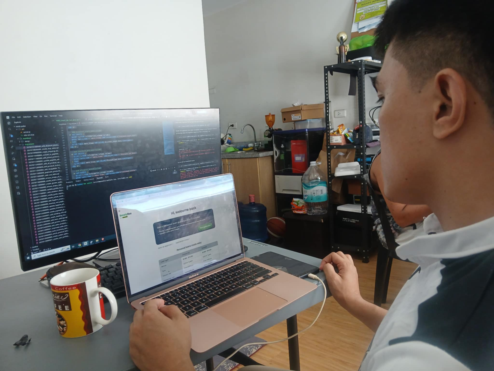
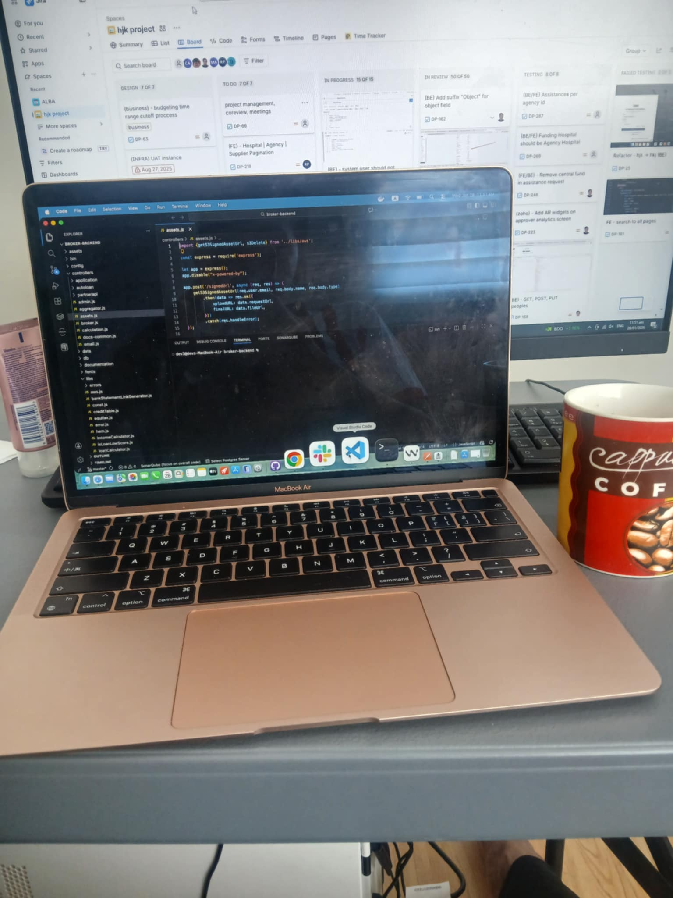
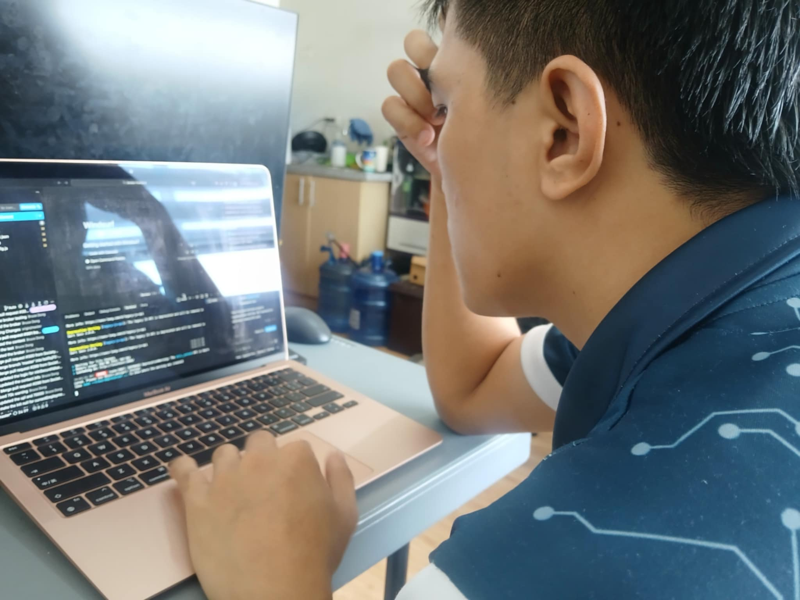

<h1 align="center">Charlie James Abejo</h1>
<h3 align="center">Full Stack Developer | Backend Engineer | Cloud & DevOps</h3>

    
    
    
    
    

    

---

### About Me

I'm a **Full Stack Developer** based in Cagayan de Oro City, Philippines, with **5 years** of professional experience building production-grade software — from secure REST APIs and scalable microservices to full-featured web and mobile applications.

I specialize in **backend architecture**, designing systems that are reliable, maintainable, and built to scale. I work confidently across the entire stack — database design, API development, frontend implementation, and cloud deployment — delivering end-to-end solutions that solve real business problems.

**Experience:** 2 Years in Professional Software Development
**Education:** Dean's Lister **(Rank 2)** — BS Information Technology
**Availability:** Open to **remote opportunities**, **contract work** & **freelance projects**

> *"Code is not just logic — it's the bridge between ideas and reality."*

 

---

### What I Do

<table>
<tr>
<td align="center" width="33%">
 
<b>Backend Engineering</b> 
REST APIs, microservices, auth systems, real-time data processing, message queues
</td>
<td align="center" width="33%">
 
<b>Frontend Development</b> 
Responsive SPAs, component design, state management, SSR/SSG, cross-browser UIs
</td>
<td align="center" width="33%">
 
<b>Cloud & DevOps</b> 
AWS deployment, Docker, CI/CD pipelines, monitoring, infrastructure as code
</td>
</tr>
</table>

---

### Tech Stack

<b>Languages</b>

 

    

<b>Frontend</b>

 

    

<b>Backend & Frameworks</b>

 

    

<b>Databases</b>

 

    

<b>DevOps & Tools</b>

 

    

---

### Workspace

    
    &nbsp;&nbsp;
    

<i>Late nights, strong coffee, and clean code.</i>

---

### GitHub Stats

    <picture>
        
    </picture>
    &nbsp;
    <picture>
        
    </picture>

    

    

 

<b>* Due to contract restrictions, most repositories are set to private *</b>

---

    <i>I'm always open to discussing new projects, ideas, or opportunities — let's build something great together.</i>

